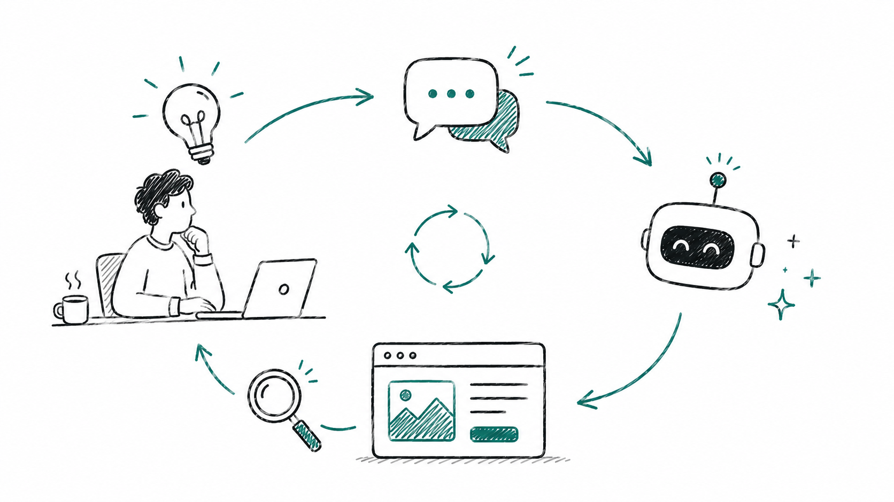

I've built sites with Claude before, but this is the first time I tried building one without writing a single line of code directly: prompting, refining those prompts, reviewing the code manually, getting it to explain its choices, and asking for changes accordingly. I built the whole thing in about four hours of active time, spread over three days.

I intentionally didn't try to one-shot it and ask for a finished site in a single prompt; I'm fairly certain that wouldn't have produced the results I was looking for. Below, in no particular order, are some of my less obvious takeaways.

1. **Pushing back on tech choices changes the answer.** I initially asked Claude to recommend tooling and frameworks for the overall structure, and it suggested Next JS. Once I pushed it to justify that choice, it changed its mind. You can definitely use AI to get a list of framework options, and follow up with more prompts to dig into the ones you don't know well, but don't let it control all the shots here.

2. **Inconsistency and repetition.** Other people have written about this behaviour recently, so I'll be brief. I wanted my pages to look consistent, but Claude built each page slightly differently. Sometimes there were design inconsistencies: different margins, different font choices. Decisions weren't centralised in the way a human developer might default to. Even when the designs looked similar, the technical changes were duplicated instead of building a common utility. This was true even after I'd overridden the project instructions markdown to be explicit about avoiding duplication.

3. **Overzealous removal.** A blessing and a curse. Claude would remove CSS classes once every instance of them was gone. Great for clearing out dead code, but sometimes I still wanted those classes, or was about to add a feature straight afterwards that would have used them.

4. **Overzealous generation.** I wanted to add content to each page bit by bit. When it first generated the repo, Claude didn't use Lorem Ipsum text or obvious image placeholders, it used its own intuition for the content. Removing it wasn't an issue, but it made it less obvious to me later which things I hadn't actually worked on yet. In both cases, it's making a call about what should or shouldn't exist when what I actually wanted was a clearer signal of what work was still remaining.

5. **The gap between markup and what's on screen.** Because it's a text-prediction engine, logical function code works pretty well. But the mapping between front-end code (HTML, CSS, SVGs) and what a user actually sees is often a little disconnected. Buttons weren't appearing when Claude thought they should be there. I've heard anecdotally from others in the industry that front-end developers' days are more numbered than back-end ones, but this experience pushes against that, at least for the visual side.

6. **Prototyping visual changes is a game changer.** Being able to test out how something will look with very low coding effort makes rapid prototyping far easier. You don't necessarily need to go through the stages of UX design and visual design first... As long as you go in knowing that prototypes are throwaway and not production code, you could build and show a product owner several options at very low engineering cost, and then bin them all. We always knew code was temporary, but now this is more obvious than ever.

7. **It's good at the things teams usually defer.** We've heard a lot about what Claude Code misses that a human developer would catch. But one thing it was genuinely great at was capturing non-functional requirements as part of a change, especially when you put them in your project's context file. Things like ARIA labels, accessibility for screen readers and keyboard users, and meta tags are the kind of thing development teams are tempted to defer to a separate tech-debt ticket while shipping the first iteration, and human developers often don't stop to consider them unless they're explicitly written into a user story. Claude included these by default, without prompting.

8. **It's a great starting place for surfacing tech debt.** I asked it to generate a list of tech debt — items that aren't obvious product features a developer would spot, but a non-technical person wouldn't know to ask for. It came back with a solid list: Open Graph images, a few security holes, image compression, a sitemap, WCAG contrast testing. These were then easy to tackle one by one. I doubt a non-developer would have enough context to understand what each item is, why it matters, or how critical it is, and whilst Claude missed a few things I would have added, it's a useful capability.

## What it said about itself

I wanted to see what Claude thought about our working process together, so I asked it to reflect on what could have worked better. It gave a long answer, which I won't reproduce here, but it ended with this brief summary:

> The common thread: I'm good at code execution once the problem is clearly defined, but I generate plausible-looking placeholders rather than flagging gaps in my knowledge, and visual iteration over text is inherently more roundabout than pointing at a screen.
